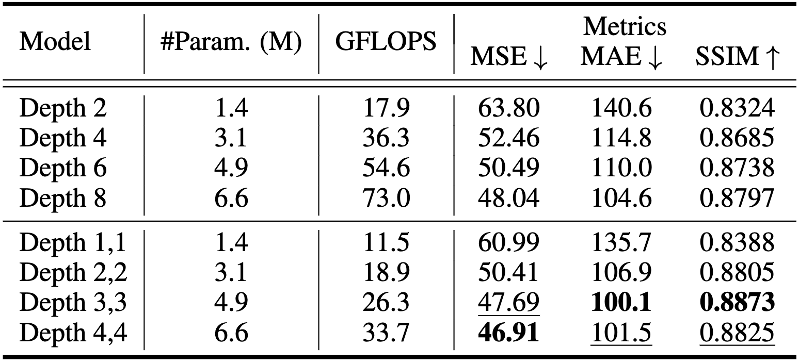
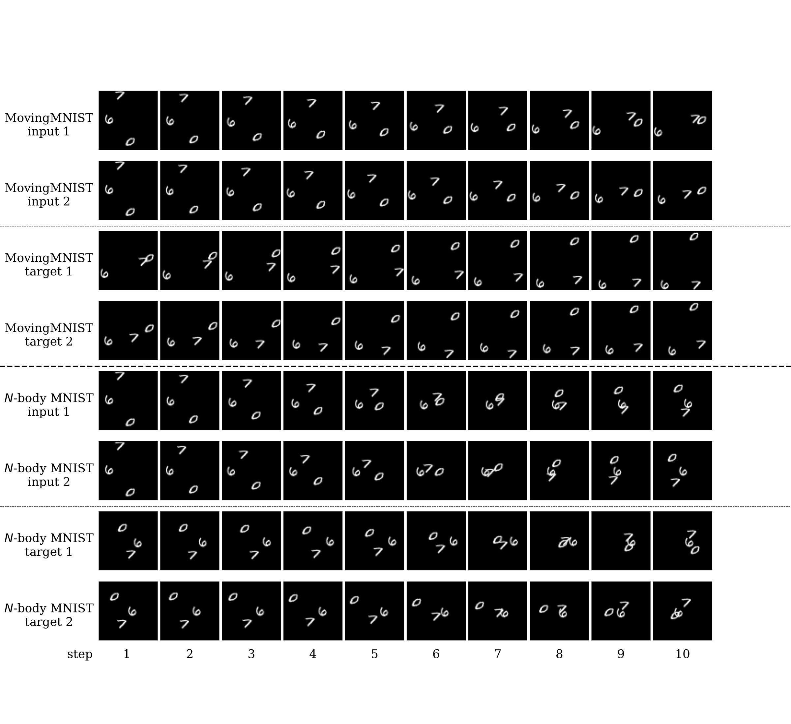

# Earthformer: Exploring Space-Time Transformers for Earth System Forecasting

[Zhihan Gao](https://scholar.google.com/citations?user=P6ACUAUAAAAJ&hl=en)$^{2\star}$, [Xingjian Shi](https://github.com/sxjscience)$^{1\dagger}$, [Hao Wang](http://www.wanghao.in/)$^3$, [Yi Zhu](https://bryanyzhu.github.io/)$^1$, [Yuyang Wang](https://scholar.google.com/citations?user=IKUm624AAAAJ&hl=en)$^1$, [Mu Li](https://github.com/mli)$^1$, [Dit-Yan Yeung](https://scholar.google.com/citations?user=nEsOOx8AAAAJ&hl=en)$^2$

$^1$Amazon Web Services, $^2$Hong Kong University of Science and Technology, $^3$Rutgers University

$^\star$Work done while being an intern at Amazon Web Services. $^\dagger$Contact person.

[Paper accepted to NeurIPS2022](https://openreview.net/forum?id=lzZstLVGVGW)

[Code](https://github.com/amazon-science/earth-forecasting-transformer)

[Poster](https://deep-earth.s3.amazonaws.com/papers/earthformer_neurips2022/Earthformer_poster_NeurIPS22.pdf)

## Abstract
Conventionally, Earth system (e.g., weather and climate) forecasting relies on numerical simulation with complex physical models and hence is both expensive in computation and demanding on domain expertise. 
With the explosive growth of spatiotemporal Earth observation data in the past decade, data-driven models that apply Deep Learning (DL) are demonstrating impressive potential for various Earth system forecasting tasks.
The Transformer as an emerging DL architecture, despite its broad success in other domains, has limited adoption in this area.
In this paper, we propose *Earthformer*, a space-time Transformer for Earth system forecasting. Earthformer is based on a generic, flexible and efficient space-time attention block, named *Cuboid Attention*. The idea is to decompose the data into cuboids and apply cuboid-level self-attention in parallel. These cuboids are further connected with a collection of global vectors. We conduct experiments on the MovingMNIST dataset and a newly proposed chaotic $N$-body MNIST dataset to verify the effectiveness of cuboid attention and figure out the best design of Earthformer. Experiments on two real-world benchmarks about precipitation nowcasting and El Niño/Southern Oscillation (ENSO) forecasting show that Earthformer achieves state-of-the-art performance.

## Problem Overview

The Earth is **chaotic, high-dimensional, spatiotemporal** and hence a **complex** system (See the following figure for an example of Earth observation data: an example Vertically Integrated Liquid (VIL) observation sequence from the [Storm EVent ImageRy (SEVIR, NeurIPS2020)](https://sevir.mit.edu/) dataset).
Improving forecasting models for the variabilities of Earth has a **huge socioeconomic impact**. E.g., it can help people take necessary precautions to avoid crises, or better utilize natural resources such as wind and solar energy.


We formulate Earth system forecasting as a spatiotemporal sequence forecasting problem. 
The Earth observation data, such as radar echo maps from [NEXRAD](https://www.ncei.noaa.gov/products/radar/next-generation-weather-radar) and climate data from [CIMP6](https://gmd.copernicus.org/articles/9/1937/2016/) , are represented as a spatiotemporal sequence $[\mathcal{X}_{i}]_{i=1}^T$, $\mathcal{X}_i \in \mathbb{R}^{H\times W\times C_{\text{in}}}$. 
Based on these observations, the model predicts the $K$-step-ahead future $[\mathcal{Y}_{T+i}]_{i=1}^K$, $\mathcal{Y}_{T+i} \in \mathbb{R}^{H\times W\times C_{\text{out}}}$.

## Method
We propose *Earthformer*, which is a hierarchical Transformer encoder-decoder based on *Cuboid Attention*. The input observations are encoded as a hierarchy of hidden states and then decoded to the prediction target.

### Architecture
As illustrated in the following figure, the input sequence has length $T$ and the target sequence has length $K$. "$\times D$" means to stack $D$ cuboid attention blocks with residual connection. "$M\times$" means to have $M$ layers of hierarchies.


### Cuboid Attention
We propose the generic cuboid attention layer that involves three steps: "decompose", "attend", and "merge" to process the input spatiotemporal tensor $\mathcal{X}\in\mathbb{R}^{T\times H\times W\times C}$. In addition, we propose to introduce a collection of $P$ global vectors $\mathcal{G}\in\mathbb{R}^{P\times C}$ to help cuboids scatter and gather crucial global information.


By stacking multiple cuboid attention layers with different choices of "$\text{cuboid\_size}$", "$\text{strategy}$" and "$\text{shift}$", we are able to efficiently explore existing and potentially more effective space-time attention.


The following table lists the configurations of the cuboid attention patterns we explored.
The first row shows the configuration of the generic cuboid attention.
The input tensor has shape $(T, H, W)$.
If "$\text{shift}$" or "$\text{strategy}$" is not given, we use $\text{shift}=\mathtt{(0, 0, 0)}$ and $\text{strategy}=\mathtt{"local"}$ by default.
When stacking multiple cuboid attention layers, each layer will be coupled with layer normalization layers and feed-forward network as in the [Pre-LN Transformer](http://proceedings.mlr.press/v119/xiong20b/xiong20b.pdf).


## Experiments

### MovingMNIST
We follow [Unsupervised Learning of Video Representations using LSTMs (ICML2015)](https://arxiv.org/abs/1502.04681) to use the [public MovingMNIST dataset](https://www.cs.toronto.edu/~nitish/unsupervised_video/).
<!-- The dataset contains 10,000 sequences. Each sequence shows 2 digits moving inside a 64x64 frame. We split the dataset to use 8,100 samples for training, 900 samples for validation and 1,000 samples for testing. The task is to predict the future 10 frames for each sequence conditioned on the first 10 frames.

The following table shows the importance of adopting a hierarchical encoder-decoder. "Depth *D*" means the model stacks *D* cuboid attention blocks and there is no hierarchical structure. "Depth *D1*,*D2*" means the model stacks *D1* cuboid attention blocks, applies the pooling layer, and stacks another *D2* cuboid attention blocks. 

 -->

### *N*-body MNIST
We extend MovingMNIST to a more challenging chaotic *N*-body MNIST by adding long-range and non-linear gravitational interactions among moving digits: 


**Access to our *N*-body MNIST dataset**:
1. [Download](https://github.com/amazon-science/earth-forecasting-transformer/blob/main/scripts/datasets/nbody/download_nbody_paper.py) the *N*-body MNIST dataset used in our paper from AWS S3.
2. Generate your custom *N*-body MNIST dataset using our [script](https://github.com/amazon-science/earth-forecasting-transformer/blob/main/scripts/datasets/nbody/generate_nbody_dataset.py) and following the [instructions](https://github.com/amazon-science/earth-forecasting-transformer/blob/main/scripts/datasets/nbody/README.md).

The following figure illustrates the chaos in *N*-body MNIST: the effect of a slight disturbance on the initial velocities is much more significant on *N*-body MNIST than on MovingMNIST. 
The top half are two MovingMNIST sequences, where their initial conditions only slightly differ in the the initial velocities. 
The bottom half are two *N*-body MNIST sequences.
 *N*-body MNIST sequence 1 has exactly the same initial condition as MovingMNIST sequence 1. 
 *N*-body MNIST sequence 2 has exactly the same initial condition as MovingMNIST sequence 2. 
 The final positions of digits in MovingMNIST after 20 steps evolution only slightly differ from each other, while the differences are much more significant in the final frames of *N*-body MNIST sequences.

 

Earthformer is able to more accurately predict the position of the digits with the help of global vectors.
On the contrary, none of the baseline algorithms that achieved solid performance on MovingMNIST gives the correct and precise position of the digit "0" in the last frame.


### SEVIR
Checkout the public leaderboard of SEVIR on [Papers With Code](https://paperswithcode.com/sota):

[](https://paperswithcode.com/sota/weather-forecasting-on-sevir?p=earthformer-exploring-space-time-transformers)

### ICAR-ENSO
Dataset available at [TIANCHI](https://tianchi.aliyun.com/dataset/dataDetail?dataId=98942).

### EarthNet2021
Checkout the public leaderboard of EarthNet2021 on [Papers With Code](https://paperswithcode.com/sota):

[](https://paperswithcode.com/sota/earth-surface-forecasting-on-earthnet2021-iid?p=earthformer-exploring-space-time-transformers)

[](https://paperswithcode.com/sota/earth-surface-forecasting-on-earthnet2021-ood?p=earthformer-exploring-space-time-transformers)

## BibTeX
```
@inproceedings{gao2022earthformer,
  title={Earthformer: Exploring Space-Time Transformers for Earth System Forecasting},
  author={Gao, Zhihan and Shi, Xingjian and Wang, Hao and Zhu, Yi and Wang, Yuyang and Li, Mu and Yeung, Dit-Yan},
  booktitle={NeurIPS},
  year={2022}
}
```
