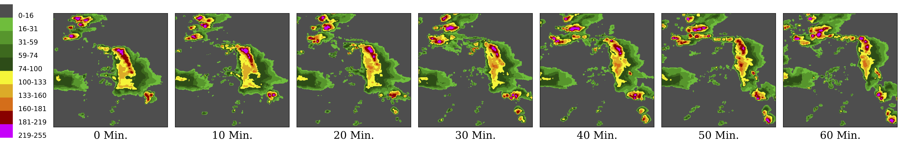
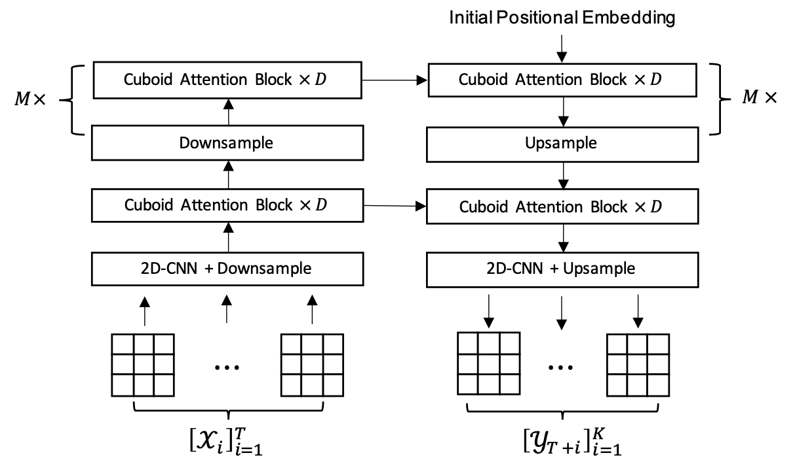
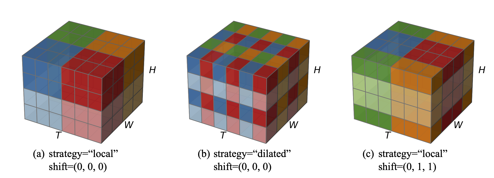
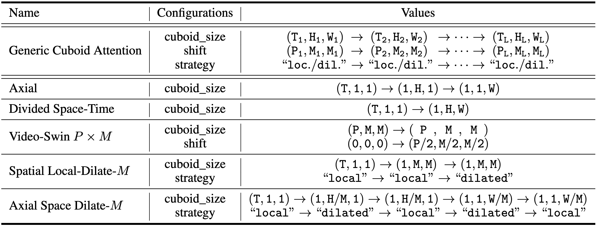

# Earthformer: Exploring Space-Time Transformers for Earth System Forecasting

[Zhihan Gao](https://scholar.google.com/citations?user=P6ACUAUAAAAJ&hl=en)<sup>2*</sup>, [Xingjian Shi](https://github.com/sxjscience)<sup>1**</sup>, [Hao Wang](http://www.wanghao.in/)<sup>3</sup>, [Yi Zhu](https://bryanyzhu.github.io/)<sup>1</sup>, [Yuyang Wang](https://scholar.google.com/citations?user=IKUm624AAAAJ&hl=en)<sup>1</sup>, [Mu Li](https://github.com/mli)<sup>1</sup>, [Dit-Yan Yeung](https://scholar.google.com/citations?user=nEsOOx8AAAAJ&hl=en)<sup>2</sup>

<sup>1</sup>Amazon Web Services, <sup>2</sup>Hong Kong University of Science and Technology, <sup>3</sup>Rutgers University

<sup>*</sup>Work done while being an intern at Amazon Web Services. <sup>**</sup>Contact person.

## Abstract
Conventionally, Earth system (e.g., weather and climate) forecasting relies on numerical simulation with complex physical models and hence is both expensive in computation and demanding on domain expertise. 
With the explosive growth of spatiotemporal Earth observation data in the past decade, data-driven models that apply Deep Learning (DL) are demonstrating impressive potential for various Earth system forecasting tasks.
The Transformer as an emerging DL architecture, despite its broad success in other domains, has limited adoption in this area.
In this paper, we propose **Earthformer**, a space-time Transformer for Earth system forecasting. Earthformer is based on a generic, flexible and efficient space-time attention block, named **Cuboid Attention**. The idea is to decompose the data into cuboids and apply cuboid-level self-attention in parallel. These cuboids are further connected with a collection of global vectors. We conduct experiments on the MovingMNIST dataset and a newly proposed chaotic *N*-body MNIST dataset to verify the effectiveness of cuboid attention and figure out the best design of Earthformer. Experiments on two real-world benchmarks about precipitation nowcasting and El Niño/Southern Oscillation (ENSO) forecasting show that Earthformer achieves state-of-the-art performance.

## Problem Overview

The Earth is **chaotic, high-dimensional, spatiotemporal** and hence a **complex** system (See the following figure for an example of Earth observation data: an example Vertically Integrated Liquid (VIL) observation sequence from the [Storm EVent ImageRy (SEVIR)](https://sevir.mit.edu/) dataset).
Improving forecasting models for the variabilities of Earth has a **huge socioeconomic impact**. E.g., it can help people take necessary precautions to avoid crises, or better utilize natural resources such as wind and solar energy.



We formulate Earth system forecasting as a spatiotemporal sequence forecasting problem. 
The Earth observation data, such as radar echo maps from [NEXRAD](https://www.ncei.noaa.gov/products/radar/next-generation-weather-radar) and climate data from [CIMP6](https://gmd.copernicus.org/articles/9/1937/2016/) , are represented as a spatiotemporal sequence.
Based on these observations, the model predicts the *K*-step-ahead future.

## Method
We propose Earthformer, which is a hierarchical Transformer encoder-decoder based on Cuboid Attention. The input observations are encoded as a hierarchy of hidden states and then decoded to the prediction target.

### Architecture
As illustrated in the following figure, the input sequence has length *T* and the target sequence has length *K*. "x *D*" means to stack *D* cuboid attention blocks with residual connection. "*M* x" means to have *M* layers of hierarchies.



### Cuboid Attention
We propose the generic cuboid attention layer that involves three steps: "decompose", "attend", and "merge".
In addition, we propose to introduce a collection of *P* global vectors to help cuboids scatter and gather crucial global information.


By stacking multiple cuboid attention layers with different choices of "cuboid_size", "strategy" and "shift", we are able to efficiently explore existing and potentially more effective space-time attention.



The following table lists the configurations of the cuboid attention patterns we explored.
The first row shows the configuration of the generic cuboid attention.
If "shift" or "strategy" is not given, we use shift=(0, 0, 0) and strategy="local" by default.
When stacking multiple cuboid attention layers, each layer will be coupled with layer normalization layers and feed-forward network as in the [Pre-LN Transformer](http://proceedings.mlr.press/v119/xiong20b/xiong20b.pdf).



## Experiments
TBA

## BibTeX
```
@inproceedings{gao2022earthformer,
  title={Earthformer: Exploring Space-Time Transformers for Earth System Forecasting},
  author={Gao, Zhihan and Shi, Xingjian and Wang, Hao and Zhu, Yi and Wang, Yuyang and Li, Mu and Yeung, Dit-Yan},
  booktitle={NeurIPS},
  year={2022}
}
```
